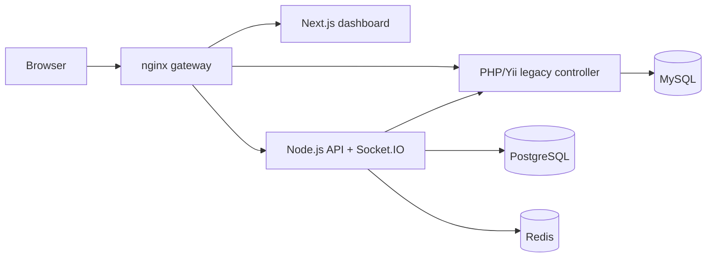

# Video Research Room Strangler Fig PoC

Portfolio-ready demo of a migration from a synchronous PHP/Yii read path to a modern Node.js/TypeScript + Next.js experience without changing the public URL.

## Why this repo exists

This PoC was built to make one migration story easy to demonstrate in an interview:

- A legacy PHP controller still serves business data through synchronous polling.
- A modern Node.js service publishes the same business event immediately through WebSockets.
- `nginx` stays in front as the stable entry point.
- The gateway can cut over a canonical route from legacy to modern live.

The result is a demo where the interviewer can see both coexistence and migration progress, not just hear about them.

## What the demo shows

- `Legacy Snapshot`: a visibly stale panel backed by PHP + MySQL, 3-second polling, and an artificial synchronous delay.
- `Modern Stream`: a real-time panel backed by Node.js + Socket.IO + Postgres/Redis.
- `Canonical route`: `/interview/session/1`, served by `nginx`, switchable between legacy and modern upstreams without changing the URL.
- `One shared business event`: click one button and watch the modern path update immediately while the legacy path catches up later.

## Architecture



## Demo narrative

The dashboard is intentionally opinionated:

1. Click `Simulate Interview Event`.
2. The modern panel updates immediately via WebSocket.
3. The legacy panel stays stale until the next poll finishes.
4. The `nginx` cutover card keeps reading the same public route and shows which upstream is serving it.
5. During the demo, switch the canonical route from legacy to modern live.

That makes the migration story concrete:

- legacy controls the user experience when it stays in the request path
- modern removes the bottleneck from the critical path
- `nginx` lets both implementations coexist behind one stable contract

## Local quick start

1. Copy the environment template.

   ```bash
   cp .env.example .env
   ```

2. Start the stack.

   ```bash
   docker compose up -d --build
   ```

3. Open the dashboard.

   ```text
   http://localhost:8080
   ```

If port `8080` is already in use on your machine, change `GATEWAY_PORT` in [`.env.example`](.env.example) before bringing the stack up.

## Live cutover commands

The canonical route is:

```text
/interview/session/1
```

Switch it live with:

```bash
./scripts/cutover-session-route.sh modern
./scripts/cutover-session-route.sh legacy
```

The dashboard keeps the same public URL and shows which upstream is currently serving that route.

## Useful endpoints

- `GET /`
- `GET /interview/session/1`
- `GET /yii-legacy/session/1`
- `GET /node-api/health`
- `GET /node-api/sessions/1/demo-events`
- `POST /node-api/sessions/1/demo-events`

## Deploying from GitHub with Portainer

This repository is safe to publish publicly as long as you keep runtime secrets and real infrastructure details out of version control.

Recommended approach:

1. Push this repository to GitHub as a public portfolio project.
2. In Portainer, create a stack from the Git repository.
3. Use `docker-compose.yml` as the stack file.
4. Populate the environment variables from [`.env.example`](.env.example) inside Portainer or through a private server-side `.env`.
5. Put the exposed `nginx` port behind your homeserver's outer HTTPS reverse proxy.
6. Make sure the outer proxy supports WebSocket upgrade headers for `/socket.io/`.
7. Keep `TRUST_PROXY=true` when running behind that HTTPS layer.

Portainer-specific note:

- The live cutover script rewrites [`nginx/includes/session-route.conf`](nginx/includes/session-route.conf) and reloads `nginx`.
- For the live cutover part of the demo, make sure the deployed stack uses a checkout you can edit on the server, or keep an accessible clone of the same deployed repository on the host.

## Environment variables

The main runtime variables are:

- `NEXT_PUBLIC_API_GATEWAY_URL`: optional explicit public origin for the frontend build
- `NEXT_PUBLIC_SOCKET_PATH`: Socket.IO path, defaults to `/socket.io`
- `CORS_ALLOWED_ORIGINS`: comma-separated browser origins allowed by the Node API
- `TRUST_PROXY`: trust `X-Forwarded-*` headers behind a reverse proxy
- `GATEWAY_PORT`: host port exposed by the internal `nginx` gateway
- `MYSQL_*`: legacy storage credentials
- `POSTGRES_*`: modern storage credentials
- `VIDEO_TOKEN_SECRET`: mock token signing secret
- `LEGACY_SIMULATED_DELAY_MS`: artificial legacy bottleneck used to make polling jank visible

## Public repo hygiene checklist

Before pushing:

- keep your local `.env` private
- commit [`.env.example`](.env.example), not real secrets
- keep domains, IPs, and certificates out of the repository
- keep Portainer itself private; publish the app, not the admin panel
- keep demo data fake and clearly marked as fake

## Repository structure

- [`frontend-next`](frontend-next): Next.js dashboard focused on legacy-vs-modern comparison
- [`modern-node`](modern-node): Express + Socket.IO service and modern read model
- [`legacy-yii`](legacy-yii): PHP/Yii-style synchronous controller
- [`nginx`](nginx): gateway routing and cutover include
- [`scripts/cutover-session-route.sh`](scripts/cutover-session-route.sh): live cutover helper for the canonical route

## Notes

- This is a demo environment, not a production-ready system.
- Seeded data is fake.
- The repo still contains a few extra modernization slices, such as mock video token generation and insights endpoints, but the main portfolio narrative is the side-by-side legacy versus modern read path.
